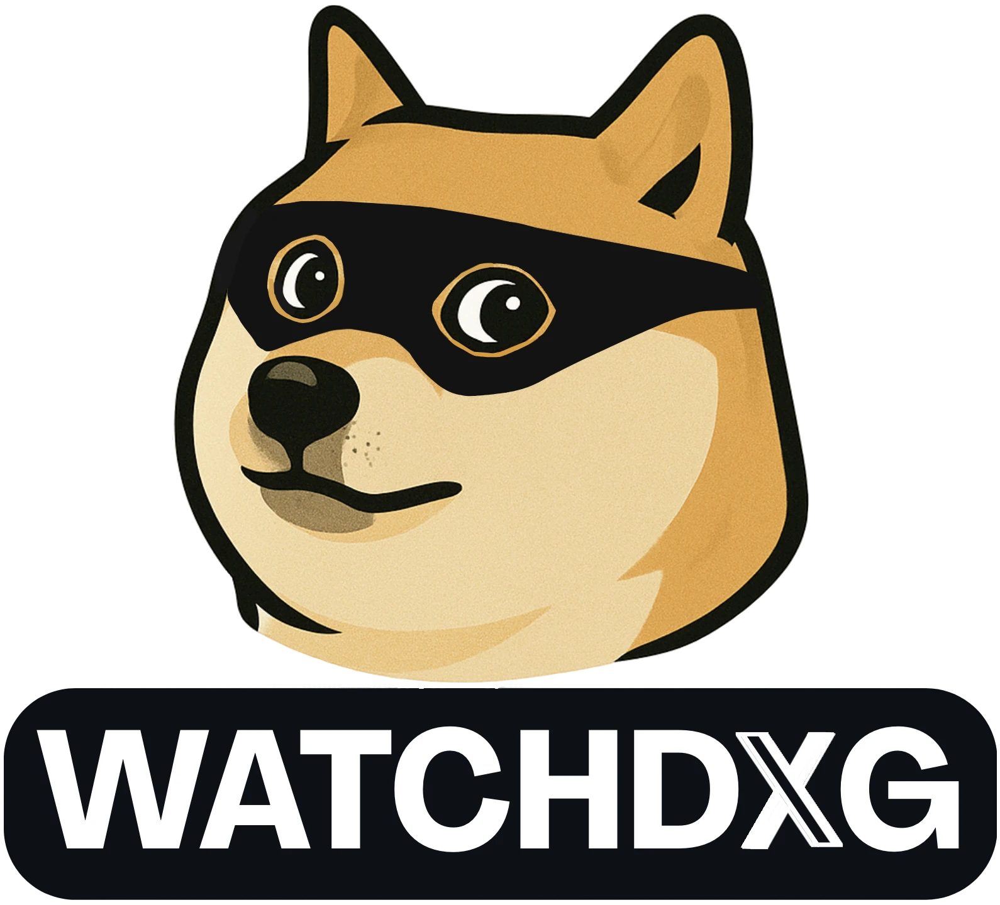

<div align="center">
  
</div>

# watchdxg-core


[](#) [](#) [](#)

## 🔍 Overview
Watchdxg is a Python-based scraper that manage one's X account to ensure it keeps a good reputation in regards to X standards.
The script logs in to an X account and evaluates the legitimacy of each account that interacts with your content.

According to some criteria, if an account is found to be a bot account that's meant to bomb your reputation, it'll be signaled and blocked by watchdxg to preserve your X account's reputation.

The goal of this project is to mitigate if not cancel the effects of discreditation campaigns that uses low-rep accounts to bomb some X accounts's reputation.

### ***Please note: This project is a Work In Progress.***

## ⚠️ ***DISCLAIMER: X's TOU/TOS prohibit automated tools on their platform. USE AT YOUR OWN RISK*** ⚠️

## 👀 Features
- Automates login to X using Playwright
- Uses BeautifulSoup to parse and extract user details
- Retrieves information such as:
  - Display name
  - User handle
  - User bio
  - It's featured website

This data will then be used to determine if said follower/user is an actual account with genuine intentions, or if it's a bot/malicious account.
Actions will then be taken accordingly (signal and block said account).

## ⚡ Setup
1. Clone the repository:
   ```bash
   git clone https://github.com/synka777/watchdxg.git
   cd watchdxg
   ```
2. Install dependencies:
   ```bash
   pip install -r requirements.txt
   ```
3. Create a `.env` file in the project directory and add your credentials:
   ```env
   USERNAME=your_x_username
   PASSWORD=your_x_password
   CONTACTINFO=your_contact_info <= (Probably a phone number)
   FFPROFILEPATH=your_firefox_profile_path
   LOCALE=the_locale_used_by_your_browser
   ```

   locale example: fr_FR.UTF-8

## 🟢 Usage
### Running the Script
To start the project, run it with the `--setup` flag once:
```bash
python src/runner.py --setup
```
Then, simply do:
```bash
python src/runner.py
```