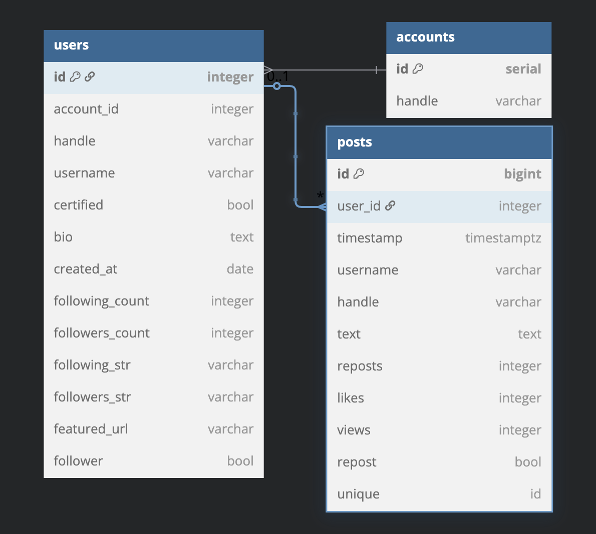

  

# watchdxg-core
### [🇬🇧 Read in English](./docs/README.md)
  

## 🔍 Présentation

watchdxg-core fait partie d’un projet plus large conçu pour protéger la réputation d’un compte X (anciennement Twitter) en identifiant les abonnés potentiellement nuisibles.

Ce dépôt met en œuvre un pipeline ETL qui extrait les données des abonnés d’un compte X donné. Sur la base de critères spécifiques, les comptes soupçonnés d’être des bots ou de faire partie de campagnes de discréditation peuvent être automatiquement signalés et bloqués.

    🛠 Projet en cours de développement

## ⚠️ Avertissement

    Les conditions d’utilisation de X interdisent les outils automatisés. UTILISEZ CE PROJET À VOS RISQUES ET PÉRILS.

## 👀 Fonctionnalités

    Connexion automatisée à X via Playwright

    Extraction des données des abonnés avec BeautifulSoup

    Récupération des informations suivantes :

        Nom d'affichage

        Pseudo (handle)

        Abonnement X (booléen)

        Date de création de compte

        Biographie

        Posts et réponses associées

        Site web mis en avant (le cas échéant)

    Tests unitaires pour vérifier que la structure HTML/CSS n’a pas changé

## 📐 Architecture du projet

Le projet est structuré pour être utilisé avec Docker.
La majeure partie du code se trouve dans le dossier src/ et la configuration de Docker est composée en deux services/conteneurs:

### 1️⃣ Un service constitué du code du pipeline
Basé sur une image docker officielle Microsoft, intégrant:
- Python
- Playwright
- Des services d'interface graphique
- Les principaux navigateurs
- VNC (pour le debugging)

### 2️⃣ Un service pour la base de données
Utilisant l'image docker officielle pour PostgreSQL. Cette image met à disposition la dernière version stable de PostgreSQL, avec une multitude de variables d'environnement pour gérer la configuration avec Docker.

Outre les services, une persistence de données a été mise en place via l'utilisation de volumes partagés entre Docker et le système hôte.

### Structure BDD:

  

## 🧠 À venir

    Mise en place d’un système de classification pour déterminer si un abonné est légitime ou malveillant

    Blocage automatique des comptes suspectés d’être des bots ou des spammeurs

⚡ Installation

    Cloner le dépôt :
    git clone https://github.com/synka777/watchdxg.git
    cd watchdxg

    Installer les dépendances :
    pip install -r requirements.txt

    Créer un fichier .env à la racine du projet contenant les informations suivantes :
    USERNAME=ton_identifiant_x
    PASSWORD=ton_mot_de_passe_x
    CONTACTINFO=ton_contact (probablement un numéro de téléphone)
    FFPROFILEPATH=chemin_vers_ton_profil_firefox

## 🟢 Utilisation en mode production

Pour initialiser la base de données et lancer le pipeline, utiliser docker-compose:

    docker-compose up -d

Pour visualiser les logs des deux services:

    docker-compose logs

## 🟣 Utilisation en mode développement (local sys. hôte)
Lancer le script pour la première fois

Pour initialiser la base de données (et autres opérations de setup), lance la commande :

    python src/runner.py --setup --dev

Lancer l'extraction ensuite :

python src/runner.py
Options supplémentaires disponibles :

    --dev
    Active le mode développement (paramètres locaux, journalisation plus détaillée, etc.).

    --head
    Lance le navigateur en mode graphique (utile pour déboguer Playwright).

## 🧪 Couverture des tests

(À venir : instructions pour lancer les tests et analyser leur couverture)

## 🧠 Auteur

Mathieu Barbé-Gayet