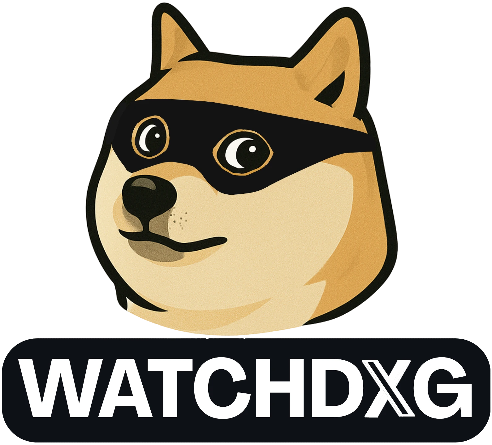

   

# watchdxg-core

## 🔍 Overview

watchdxg-core is part of a broader project designed to protect the reputation of an X account (formerly Twitter) by identifying potentially harmful followers.

This repository implements an ETL pipeline that extracts data from the followers of a given X account. Based on specific criteria, accounts suspected of being bots or part of discrediting campaigns can be automatically flagged and blocked.

    🛠 This project is currently a Work In Progress.

## ⚠️ Disclaimer

    X's Terms of Service prohibit automated tools. USE THIS PROJECT AT YOUR OWN RISK.

## 👀 Features

    Automated login to X using Playwright

    Follower data extraction using BeautifulSoup

    Extraction of the following information:

        Display name

        Handle (username)

        X Premium status (boolean)

        Account creation date

        Bio

        Recent posts and replies

        Highlighted website (if any)

    Unit tests to verify that the HTML/CSS structure hasn’t changed

## 📐 Project Architecture

The project is designed to run with Docker.
Most of the code resides in the src/ directory, and the Docker setup is built around two main services/containers:
### 1️⃣ Pipeline Service

Based on an official Microsoft Docker image, it includes:
- Python
- Playwright
- GUI services
- Major browsers
- VNC (for debugging purposes)

### 2️⃣ Database Service

Based on the official PostgreSQL Docker image. This image provides the latest stable PostgreSQL version and supports a wide range of environment variables for Docker configuration.

Data persistence is handled using Docker volumes shared between the containers and the host system.

### Database Schema:

   

## 🧠 Roadmap

    Implement a classification system to determine whether a follower is legitimate or malicious

    Automatically block accounts suspected to be bots or spammers

## ⚡ Setup

Clone the repository:
git clone https://github.com/synka777/watchdxg.git
cd watchdxg

Install dependencies:
pip install -r requirements.txt

Create a .env file at the root of the project containing the following:

USERNAME=your_x_username
PASSWORD=your_x_password
CONTACTINFO=your_contact_info (likely a phone number)
FFPROFILEPATH=your_firefox_profile_path

## 🟢 Running in Production (with Docker)

To initialize the database and start the pipeline:
docker-compose up -d

To view logs from both services:
docker-compose logs
## 🟣 Running in Development (on host system)

First run with setup step:
python src/runner.py --setup --dev

Then launch extraction:
python src/runner.py

Additional options:

    --dev: Enables development mode (local config, more verbose logs, etc.)

    --head: Launches the browser in visible mode (useful for debugging Playwright)

## 🧪 Test Coverage

(Coming soon: instructions on how to run the tests and check their coverage)

## 🧠 Author

Mathieu Barbé-Gayet